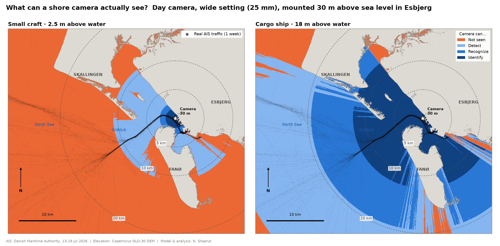
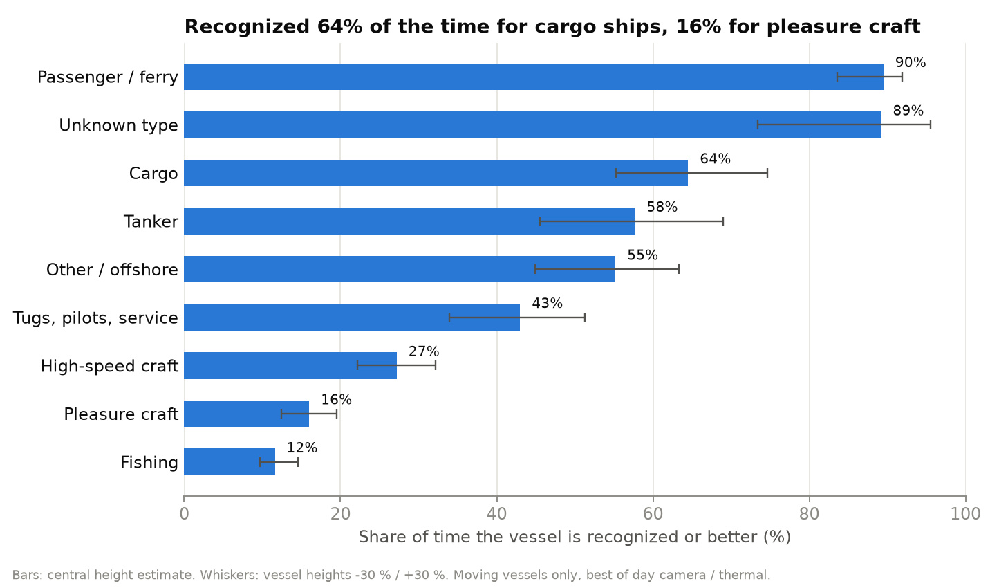
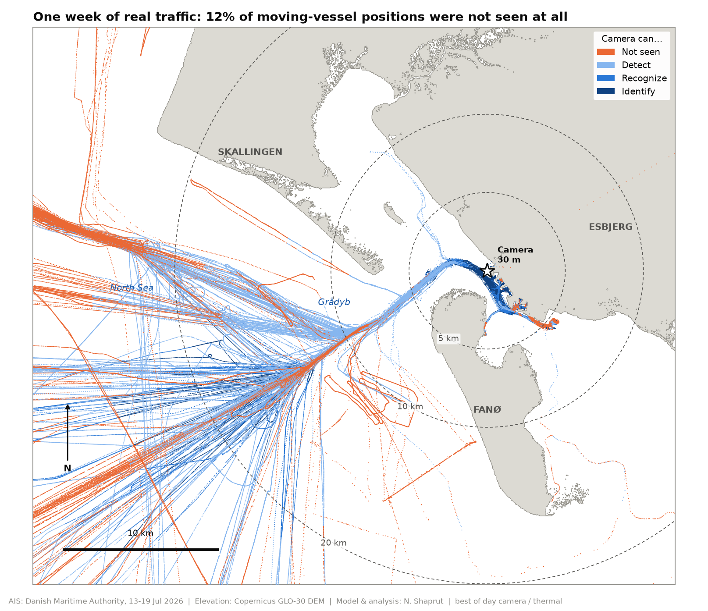
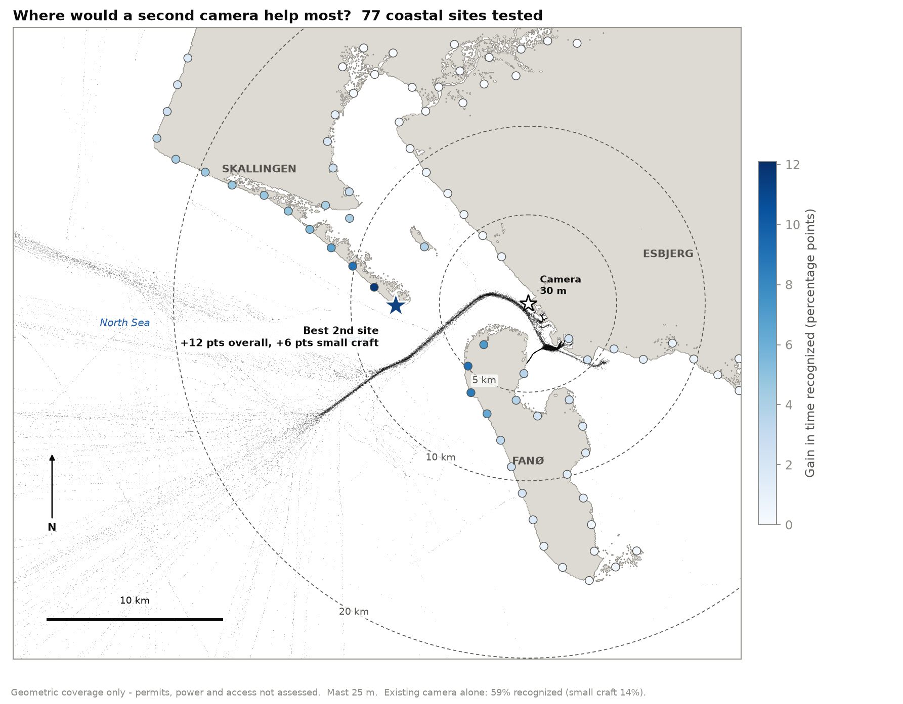
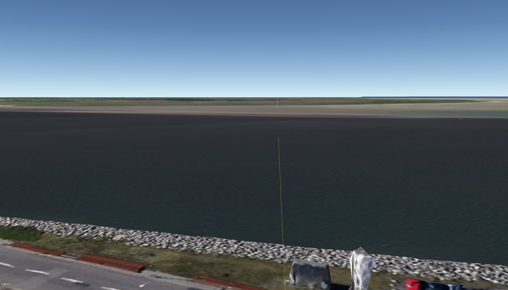
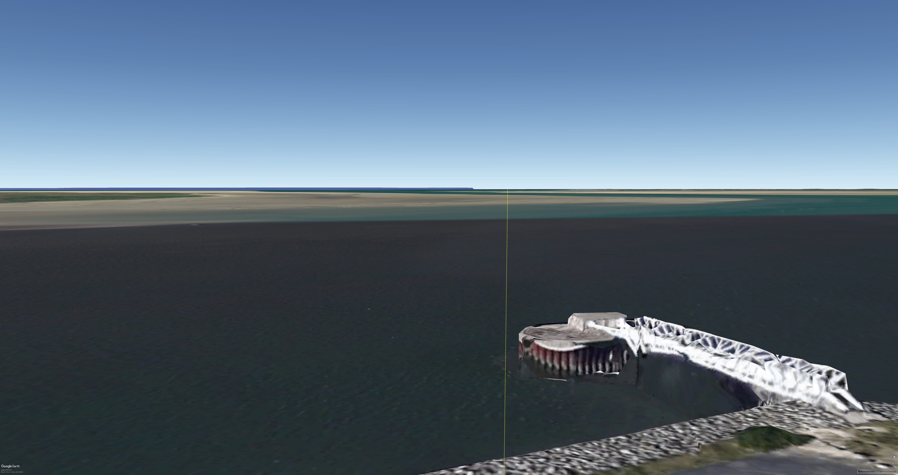
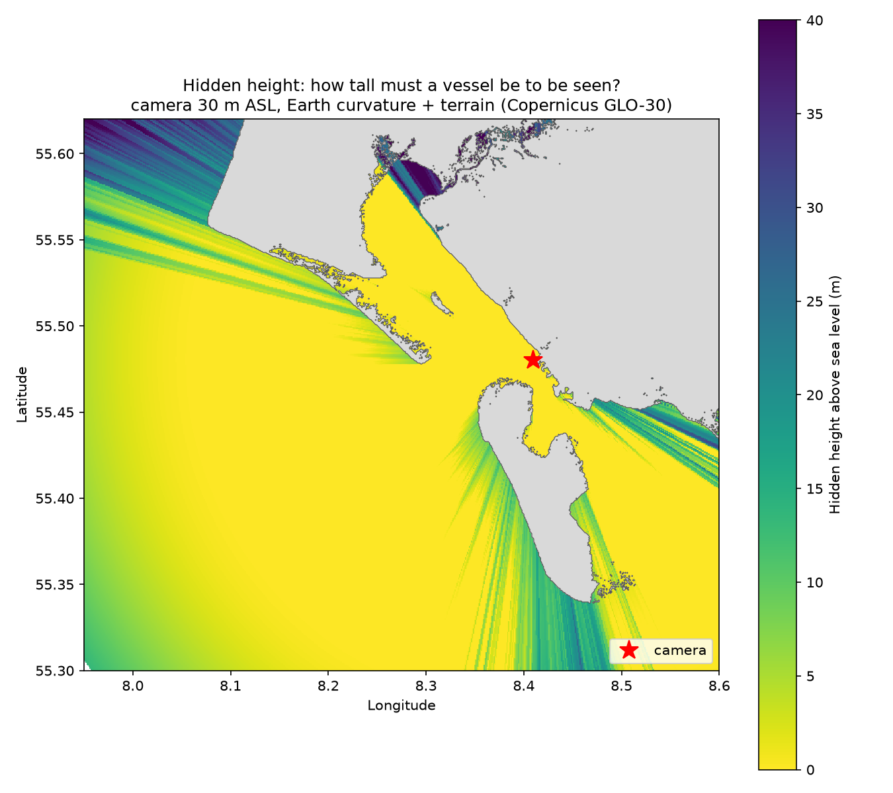

# Shore Camera DRI — What Can a Coastal Camera Actually See?

A shore-mounted EO/IR camera watches the approach to the port of Esbjerg, Denmark.
**What share of the real vessel traffic can it detect, recognize and identify — and where
are its blind spots?**

This project answers that question with one week of real AIS traffic, an open elevation
model and a geometric camera model. No machine learning: every number traces back to a
formula and an assumption that is written down.



## Key findings

| | |
|---|---|
| **59 %** | of the time a moving vessel is in the area, the camera **recognizes** it (51–66 % across the vessel-height uncertainty range) |
| **89 %** | of vessel transits are recognized **at least once** — coverage is good on the main channel, patchy elsewhere |
| **16 % vs 90 %** | pleasure craft are recognized 16 % of the time, ferries 90 %. Pleasure craft are **not seen at all 53 %** of the time |
| **+12 pts** | a second camera at the best of 77 tested coastal sites raises recognition from 59 % to 71 % |



## The question behind it

Camera-based maritime awareness turns existing port and coastal cameras into sensors. Before
any detection model runs, there is a geometry question: **which vessels can this camera
physically resolve, where, and how often?** A camera 30 m above the water sees the sea
horizon at about 21 km, but a 2.5 m pleasure craft drops below 2 pixels — the detection
threshold — long before that.

## Method

```
AIS (1 week)  ──►  clean & split into transits  ──►  vessel height per hull (assumption, ±30 %)
                                                                 │
DSM (30 m)    ──►  line of sight from the camera:                ▼
                   Earth curvature + terrain     ──►  visible height = vessel height − hidden height
                                                                 │
Sensor model  ──►  pixels on target = visible height × focal length / (distance × pixel pitch)
                                                                 │
                                                                 ▼
                   Johnson criteria: detect ≥ 2 px · recognize ≥ 8 px · identify ≥ 12.8 px
```

**Line of sight.** Along 1,800 rays from the camera, every DSM cell (sea = 0 m) is converted to
an elevation angle after the curvature drop *d² / 2R_eff* (refraction k = 0.13). The running
maximum of that angle is the line that hides everything below it — one calculation covers both
Earth curvature and the islands, dunes and buildings in between.

**Sensors** (typical components, not a specific product):

| Sensor | Pixel pitch | Focal length | Horizontal FOV | Role |
|---|---|---|---|---|
| EO wide | 2.9 µm, 1920 px | 25 mm | ~13° | continuous day watch |
| EO zoom | 2.9 µm, 1920 px | 100 mm | ~3° | zoomed in on one target |
| IR | 17 µm, 640 px | 50 mm | ~12° | night (same FOV as EO wide) |

EO counts only in daylight (sun above −6°, computed per position); IR counts day and night.
"Best available" is what an operator would use: EO wide or IR by day, IR at night.

**Vessel height.** AIS reports length, not height. Height = clamp(ratio × length, min, max) per
class ([assumptions/vessel_heights.csv](assumptions/vessel_heights.csv)). Every result is computed
three times — central, −30 % and +30 % — so each number comes with its sensitivity to this
assumption.

## Results

### Real traffic, coloured by what the camera saw



The Grådyb approach channel is recognized or identified almost everywhere. Recognition falls
off on the open-sea routes beyond ~15 km, and small craft working north-west of Fanø sit in
the island's shadow.

### Sensors compared — recognized-or-better, share of moving-vessel time

| Vessel class | EO wide | EO zoom | IR (day & night) | Best available |
|---|---|---|---|---|
| All vessels | 55 % | 81 % | 42 % | **59 %** |
| Cargo | 62 % | 88 % | 40 % | 64 % |
| Passenger / ferry | 82 % | 89 % | 78 % | 90 % |
| Fishing | 9 % | 54 % | 8 % | 12 % |
| Pleasure craft | 14 % | 42 % | 7 % | 16 % |

Zooming in (EO zoom) lifts recognition from 55 % to 81 % — but through a 3° field of view.
The trade-off between range and coverage is the core design choice for a shore camera.

### Where would a second camera help most?



77 coastal sites (1.5 km apart, 25 m mast) were tested against the same week of traffic:

| Site | Recognized, all vessels | Recognized, small craft |
|---|---|---|
| Existing camera alone | 59 % | 14 % |
| + Skallingen tip (geometric optimum) | **71 %** (+12) | 19 % (+5.5) |
| + North-west Fanø | 68 % (+9) | **21 %** (+7) |

The geometric optimum faces the existing camera across the Grådyb channel. Skallingen is a
protected landscape without infrastructure, so the north-west coast of Fanø — about 75 % of
the overall gain and *more* gain for small craft — may be the practical choice. Permits,
power and access are not part of this model.

## Validation

**Model vs. analytic curvature.** Over open sea the horizon table matches the closed-form
Earth-curvature result exactly (1.11 m hidden at 25 km, 5.58 m at 30 km for a 30 m camera).

**Model vs. Google Earth**, viewed from the camera position at 30 m:

| Bearing 218° — Fanø blocks the sea horizon | Bearing 265° — the Grådyb opening is clear |
|---|---|
|  |  |

Both agree with the hidden-height map. One instructive difference: behind Fanø the model says
the sea surface becomes geometrically visible again about 10 km out along 218°, but only as a
band ~0.03° above the island — less than a pixel in a wide view. "Geometrically visible" and
"visible in practice" differ; the pixels-on-target step is what closes that gap.



## Data quality findings

Found while building the pipeline — each one changed a rule or is documented here:

- **22 % duplicate receptions** — the same message received by several shore stations.
- **49 position spikes** in 1.7 M positions — removed when the implied speed both into and out
  of a point exceeds 50 kn (testing only the incoming speed also removed the correct next point).
- **14,504 "moving" positions from moored boats** — Class B transponders report noisy 1–2 kn
  speeds while tied up. A position now counts as moving only if the vessel moved ≥ 100 m in the
  last 5 minutes.
- **A transponder driving through town** — an AIS track crossing Esbjerg on land (a boat on a
  trailer). 76 transits with ≥ 80 % of positions on land are excluded.
- **AIS ship types hide a whole fleet** — offshore-wind service vessels (crew-transfer and
  service-operation vessels) broadcast "Other" or "Undefined", so the largest "other" class spans
  7 m to 154 m. Results are therefore computed per hull, not per class average.
- **Time zone** — not documented in the files; the daily traffic cycle (quietest 00–01, sharp rise
  02–05) fits UTC, i.e. a working day starting 04–07 local time.

## Known limitations

- Geometric best case: haze, rain, sea state, sun glare and image contrast are not modelled.
- The camera is assumed able to point anywhere (pan/tilt); field of view is reported, not enforced.
- Vessel heights are estimated from length (±30 % shown everywhere).
- DSM: 30 m resolution, radar-derived, includes trees and may predate recent buildings. Quays and
  water share cells inside harbour basins. Cells below 1 m are treated as sea, so very low marsh
  and tidal flats count as water (a few hundred positions on low land remain).
- Only vessels that transmit AIS are in the traffic baseline; many small craft do not, so the real
  small-craft picture is likely worse.
- 20 % of pleasure-craft transits are recognized only at night (IR). This may be real (late
  returns, early departures) or residual noise; it is left open rather than filtered away.
- One summer week; traffic mix and daylight differ in winter.

## Pipeline

| Step | Script | Output |
|---|---|---|
| 1. Prepare AIS | `scripts/01_prepare_ais.py` | cleaned positions, vessels, transit summary |
| 2. Vessel heights | `scripts/02_vessel_heights.py` | height per vessel (central, −30 %, +30 %) |
| 3. Line of sight | `scripts/03_terrain_horizon.py` | horizon table, hidden-height map |
| 4. DRI per position | `scripts/04_dri.py` | DRI per AIS position and sensor, summaries |
| 5. Figures | `scripts/05_maps.py` | `docs/images/fig1–3` |
| 6. Second camera | `scripts/06_second_camera.py` | site ranking, `docs/images/fig4` |
| Checks | `scripts/check_vessels.py`, `scripts/check_diagnostics.py` | vessel lists, time-zone and land checks |

All parameters live in [`config.yaml`](config.yaml).

## Run it

```bash
pip install -r requirements.txt
# AIS: Danish Maritime Authority daily files (aisdk-YYYY-MM-DD.zip) -> data/raw/ais/
# DEM: Copernicus GLO-30 tile N55 E008 -> data/raw/dem/
python scripts/01_prepare_ais.py
python scripts/02_vessel_heights.py
python scripts/03_terrain_horizon.py
python scripts/04_dri.py
python scripts/05_maps.py
python scripts/06_second_camera.py
```

Test without real data: `python tests/make_sample_dma.py data/raw/ais/sample_dma.csv`.

## Data sources

- **AIS:** Danish Maritime Authority, historical AIS data (free download), 13–19 July 2026.
- **Elevation:** Copernicus DEM GLO-30, accessed via the AWS Open Data Registry.
- **Validation views:** Google Earth (imagery © Airbus, data SIO, NOAA, U.S. Navy, NGA, GEBCO,
  Landsat / Copernicus).

---

*Netanel Shaprut — geospatial & visual data analysis ·
[LinkedIn](https://www.linkedin.com/in/netanelshaprut)*